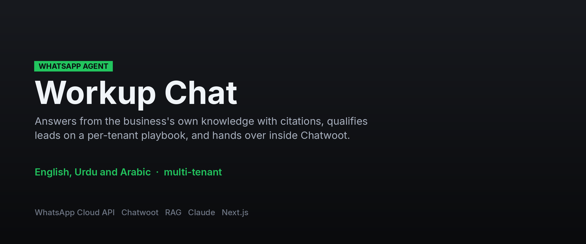
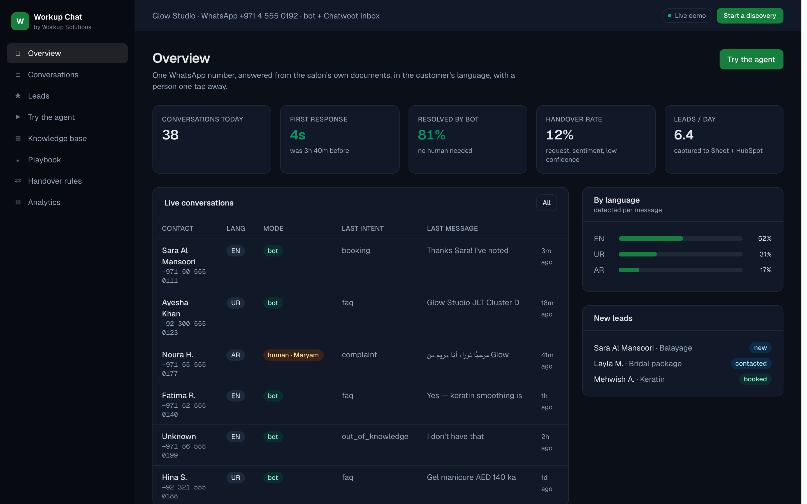

**[← All systems](https://github.com/musabqazi)** · [Voice Receptionist](https://github.com/musabqazi/voice-receptionist) · [Outbound Engine](https://github.com/musabqazi/outbound-engine) · [Browser Operator](https://github.com/musabqazi/browser-operator)

# WhatsApp Agent — WhatsApp support and lead-qualification agent

A WhatsApp agent that answers from the business's own knowledge (RAG with citations kept for
the operator), qualifies leads with a per-tenant playbook, books or takes orders, and hands
over to a human inside a shared Chatwoot inbox. English, Urdu (including Roman Urdu) and
Arabic. Multi-tenant.

real retrieval + grounding logic over the demo salon's knowledge base. **Spec:** [SPEC.md](SPEC.md)

🟢 **Live demo:** https://workup-chat.vercel.app · **Source:** private, available on request

## Dashboard

The operator's view of the WhatsApp agent: conversations, qualification state, and the citations kept behind every answer.

## The problem

Replies take hours, staff repeat the same answers, leads go cold at night. In Pakistan and
the Gulf, WhatsApp is the front door.

## What it does

1. **Receive and classify.** Cloud API webhook → Redis queue. Voice notes are transcribed
   first. Haiku tags intent, language, sentiment and `needs_human`.
2. **Retrieve.** Hybrid search (BM25 + embeddings in pgvector, reranked) over the tenant's
   PDFs, pages, pasted text and catalogue CSV. See [lib/kb.ts](lib/kb.ts) for the demo
   retriever with the same shape.
3. **Answer, then check.** Sonnet answers only from retrieved chunks, under 60 words, in the
   customer's language. A checker confirms every figure traces to a chunk; if it does not, an
   extractive answer replaces the model's ([lib/chat-agent.ts](lib/chat-agent.ts)).
4. **Qualify or hand over.** One playbook question at a time; `capture_lead` writes to
   Sheet / HubSpot. A request for a person, negative sentiment, tenant keywords or two
   consecutive low-confidence turns flip the conversation to Chatwoot; the bot stays silent
   until handed back. After the 24-hour window only approved templates are sent.

## Stack

    

## A note on what you can see here

The live demo runs on **seeded demo data** — a fictional tenant and synthetic records throughout. No client data appears in the demo or in this repository, and the implementation is private.

---
Part of the <a href="https://github.com/musabqazi">musabqazi portfolio</a> · source private. © 2026 Musab Qazi
